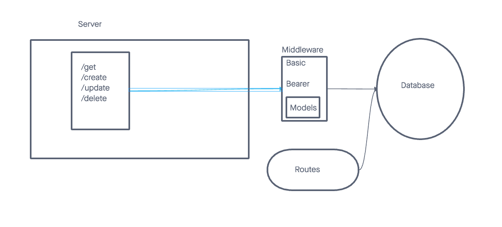

# LAB - 03

## Project: Bearer Auth

### Author: Kenya Womack and Malik Torres

### Problem Domain

Your application must employ the following programming concepts:

API Auth server must be deployed. A single, backend application is expected
Use of your API server to perform database operations
Use of login/auth/acl to control access to your resources

### Links and Resources

- [GitHub Actions ci/cd](https://github.com/MalikTorres/inventory-server)

### Collaborators

Malik Torres

### Setup

#### `.env` requirements (where applicable).

Using only PORT which can be found on `.env.sample`

#### How to initialize/run your application (where applicable)

Clone repo, `npm i`, then run `nodemon` in the terminal

#### Routes

- GET : `/` - specific route to hit

#### Tests

To run tests, after running `npm i`, run the command `npm test`.

#### UML

